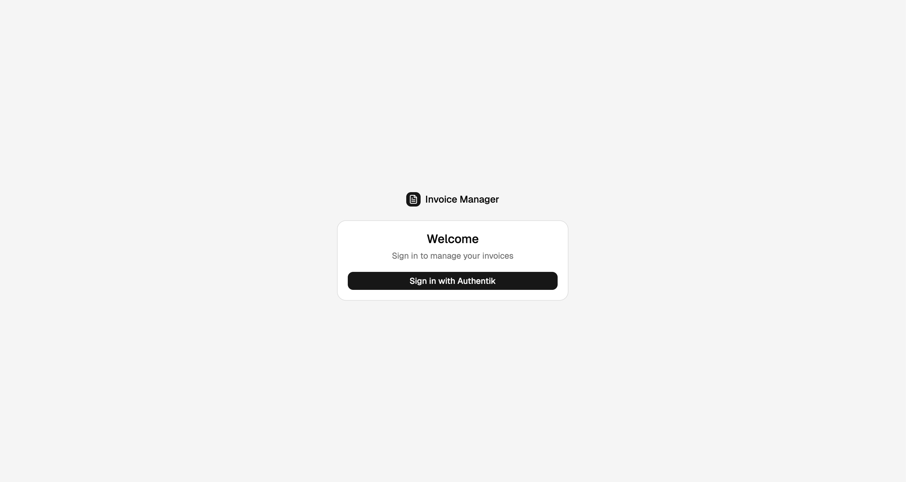
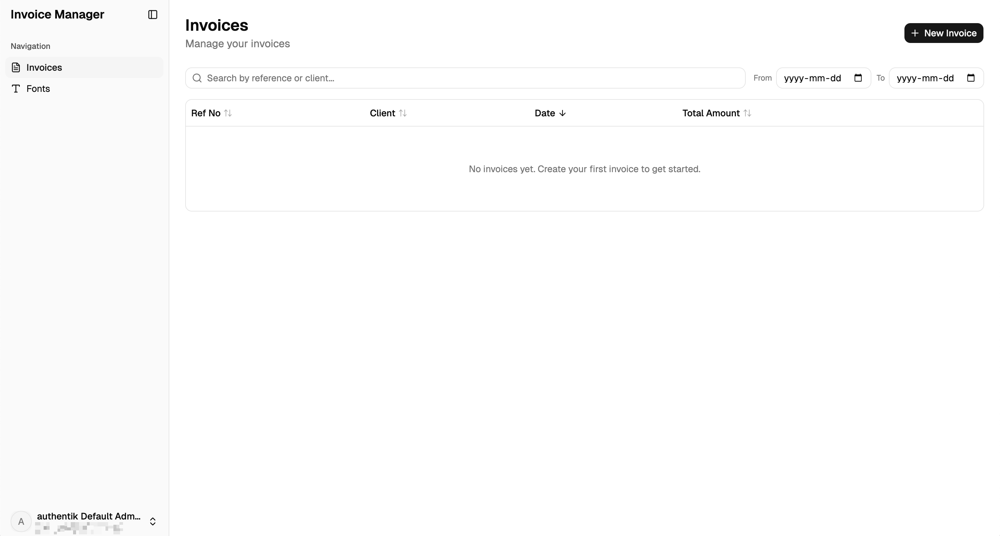
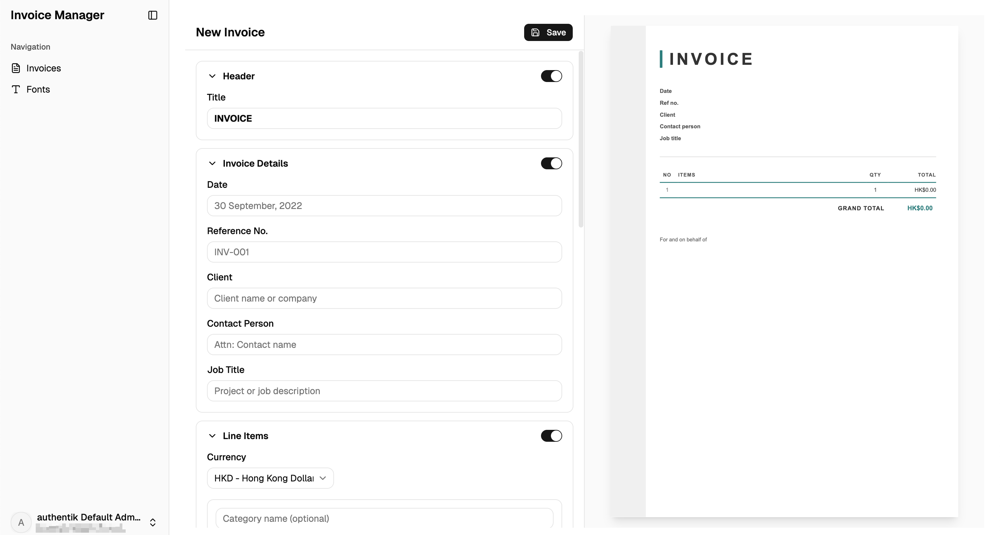
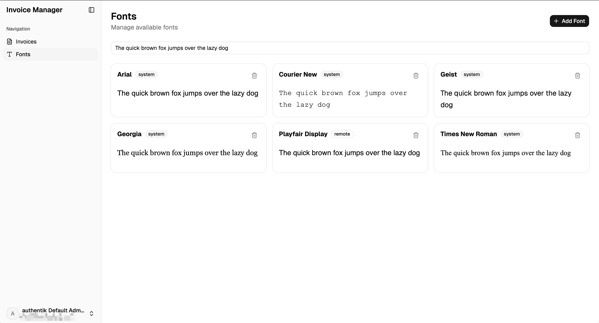

# Invoice Manager

A self-hosted invoice management app with live preview, PDF export, custom fonts, and OIDC authentication.

## Screenshots

| Login | Invoice Dashboard |
|:---:|:---:|
|  |  |

| Invoice Editor | Font Management |
|:---:|:---:|
|  |  |

## Quick Start (Production)

Run with Docker Compose (pulls pre-built image from GHCR):

```bash
git clone <repo-url> && cd invoice_manager
cp .env.example .env  # configure OIDC and database settings
docker compose up -d
```

Open [http://localhost:3000](http://localhost:3000). Postgres, backend, and frontend all start automatically.

Seed default fonts:

```bash
docker compose exec invoice_manager node src/db/seed.js
```

### Environment Variables

Copy `.env.example` and configure as needed. Key variables for production:

| Variable | Description |
|---|---|
| `DATABASE_URL` | PostgreSQL connection string |
| `OIDC_DISCOVERY_URL` | OIDC provider discovery URL |
| `OIDC_CLIENT_ID` | OIDC client ID |
| `OIDC_CLIENT_SECRET` | OIDC client secret |
| `OIDC_REDIRECT_URI` | OAuth callback URL (optional, auto-detected from request) |
| `BYPASS_LOGIN` | Set `true` to skip OIDC (dev only) |

See `.env.example` for the full list.

## Development

### Docker (full stack)

Everything in containers with hot reload:

```bash
docker compose -f docker-compose.dev.yml up -d --build
```

- Frontend: [http://localhost:5173](http://localhost:5173)
- Backend: [http://localhost:3000](http://localhost:3000)
- Source changes in `backend/src/` and `frontend/src/` reload automatically.

### Native (database in Docker)

Postgres in Docker, app runs natively for faster iteration:

```bash
# Start Postgres
docker compose -f docker-compose.dev.yml up -d postgres

# Backend (port 3000)
cd backend
cp .env.example .env
npm install
npm run db:migrate
npm run db:seed
npm run dev

# Frontend (port 5173)
cd frontend
npm install
npm run dev
```

### Fully native (no Docker)

Install PostgreSQL 18 locally and create the database:

```bash
createdb -U postgres invoice_manager
```

Then configure and run:

```bash
cd backend
cp .env.example .env
# Edit .env with your Postgres credentials
npm install && npm run db:migrate && npm run db:seed && npm run dev

# In another terminal
cd frontend && npm install && npm run dev
```

## Tech Stack

- **Frontend**: React 19, Vite 7, Tailwind CSS 4, shadcn
- **Backend**: Express 5, Drizzle ORM, PostgreSQL 18, Puppeteer
- **Auth**: OIDC (any provider -- Authentik, Keycloak, etc.)
- **Infra**: Single-container Docker (Nginx + Node + Supervisor)
